# Keycloak Integrations
#### **Integrating Bitbucket Data Center with Keycloak/RHBK**

This guide provides a step-by-step process for securing a Bitbucket Data Center instance with Keycloak/RHBK. The primary method uses the **SAML SSO & User Sync app by resolution GmbH** with the OpenID Connect (OIDC) protocol. This approach enables robust user provisioning, group synchronization, and a seamless single sign-on experience.

An alternative configuration for Bitbucket's [built-in SSO authenticator](#50-alternative-approach-using-the-built-in-oidc-authenticator) is also included for comparison. This approach require setup of connection to external directories such as `LDAP` or `Actie Directory` for user management and group membership.

Both approaches require explicitly grant of users or groups access to Bitbucket in the `global permission` screen as will explained later.

## **1.0 Prerequisites**

* A running Bitbucket Data Center instance, installed via the official binary installer.  
* A running and accessible Keycloak/RHBK instance.  
* A valid (or 30-day trial) license for both Bitbucket Data Center and the "SAML SSO & User Sync" app from the Atlassian Marketplace.  
* Network connectivity and proper DNS resolution between all services.

### **1.1 Initial Bitbucket Server Setup (HTTPS)**

Before configuring SSO, it is essential that your Bitbucket instance is accessible over HTTPS.

1. **Locate server.xml**: Find the primary server configuration file within your Bitbucket installation directory.  
2. **Configure TLS/SSL**: Edit server.xml to enable the HTTPS connector. This involves providing a Java Keystore (.jks) file that contains your server's private key and the full certificate chain (including the Root CA).

## **2.0 Keycloak/RHBK Server Configuration**

This integration requires **two separate OIDC clients*** in Keycloak: one for the user-facing SSO login and another for the backend User Sync connector.

### **2.1 OIDC Client for User Sync Connector**

**This client is critical and must be configured first.** The User Sync connector needs a service account with permissions to read users and groups from your realm via the Keycloak API.

1. **Navigate**: Clients \-\> Create client.  
2. **Client Details**:  
   * **Client ID**: bitbucket  
   * **Client type**: OpenID Connect  
3. **Capability config**:  
   * Enable **Client authentication**.  
   * Enable **Authorization**.  
   * Make sure, that **Service accounts roles** is enabled.  
   * Disable all other flows (like Standard flow, Direct access grants).  
4. **Save** the client.  

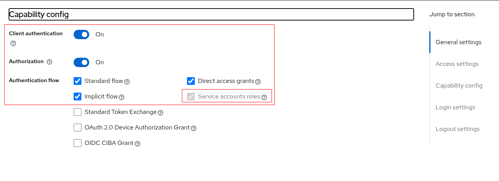

5. **Login settings**:  
   * **Valid redirect URIs**: You will get this URL from the resolution GmbH plugin in a later step. For now, you can use a placeholder like `http://placeholder`.     
6. **Assign Service Account Role**:  
   * Navigate to the **Service account roles** tab for the bitbucket-user-sync client.  
   * Click **Assign role**.  
   * Filter for client roles and select the realm-management client.  
   * Assign the **manage-users** role. This grants the necessary permissions to read user and group data.

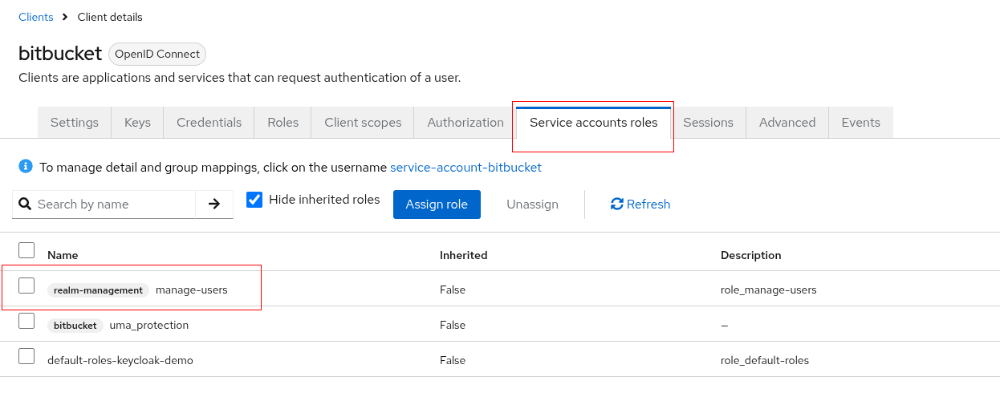

### **2.2 OIDC Client for User SSO**

This client handles the interactive login flow for end-users.

1. **Navigate**: Clients \-\> Create client.  
2. **Client Details**:  
   * **Client ID**: bitbucket-sso  
   * **Client type**: OpenID Connect  
3. **Capability config**:  
   * Enable **Client authentication**.  
   * Enable **Standard flow** and **Direct access grants**.  
4. **Login settings**:  
   * **Valid redirect URIs**: You will get this URL from the resolution GmbH plugin in a later step. For now, you can use a placeholder like `http://placeholder`.  
5. **Save** the client and copy the **Client secret** from the **Credentials** tab.

## **3.0 Bitbucket Configuration (resolution GmbH Plugin)**

### **3.1 Install the App and Apply License**

1. In Bitbucket, navigate to **Administration** \-\> **Add-ons** \-\> **Find new apps**.  
2. Search for and install **SAML SSO Single Sign On for Bitbucket**.  
3. In Bitbucket, navigate to **Administration** \-\> **Add-ons** \-\> **Manage apps**.  
4. Apply your (or 30-day trial) license for the app.

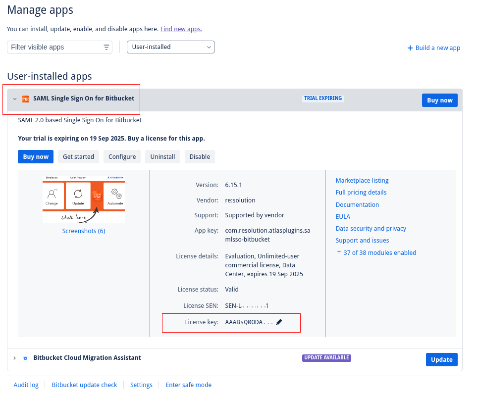

### **3.2 CRITICAL: Configure the User Sync Connector FIRST**

The User Sync connector must be configured and run before the SSO provider to ensure that users exist in Bitbucket before they attempt to log in.

1. **Navigate**: **Administration** \-\> **User Sync**.  
2. In the **Connector Configurations** section, click **Create Connector** and select **Keycloak**.  
3. **Configure the Connector**:  
   * Provide the details for your **bitbucket** client from [section 2.1](#21-oidc-client-for-user-sync-connector) (Keycloak URL, Realm, Client ID, Client Secret).  
   Use `Save and Test Connection with Keycloak` button for validation.  
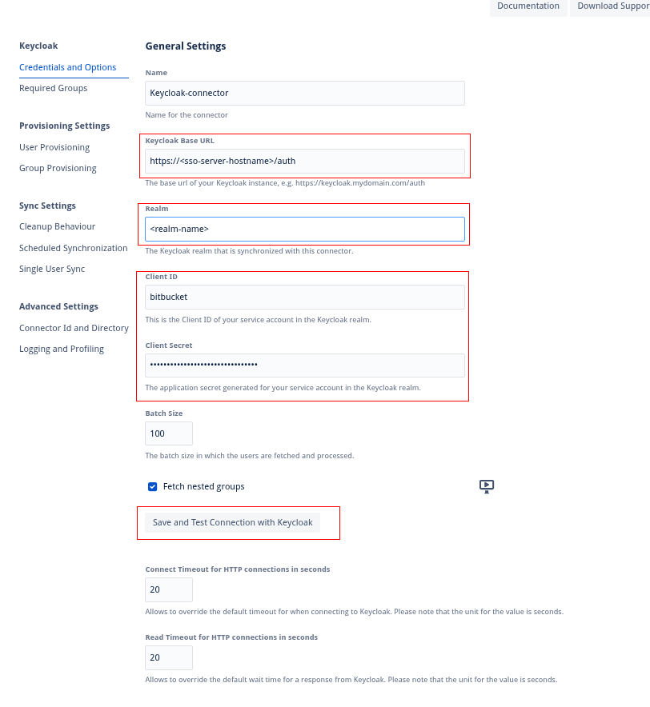

4. **Save and Sync**:  
   * Save the connector configuration.  
   * In the list of connectors, find your new Keycloak connector and click the **Sync** link. This will perform the initial import of users and groups from your Keycloak realm into Bitbucket.  

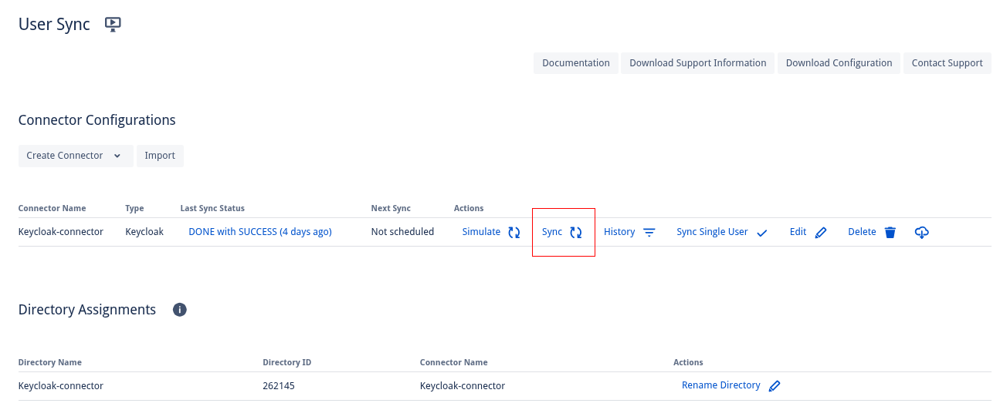

5. **Verify**: Check that users and groups now appear under **Administration** \-\> **Users** and **Groups**.

### **3.3 Configure the SSO Identity Provider (IdP)**

1. **Navigate**: **Administration** \-\> **SAML Single Sign On**.  
2. Click **Add new IdP** and select **Keycloak** as the provider type and **OpenID Connect** as the protocol.  

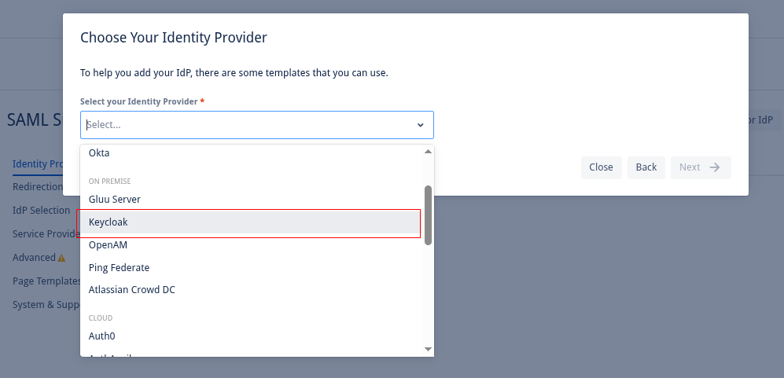

3. **Configure IdP**:  
   * Provide the details for your **bitbucket** client from [section 2.1.](#21-oidc-client-for-user-sync-connector).  
   * Check the box for **Display a button on the login page**.  
   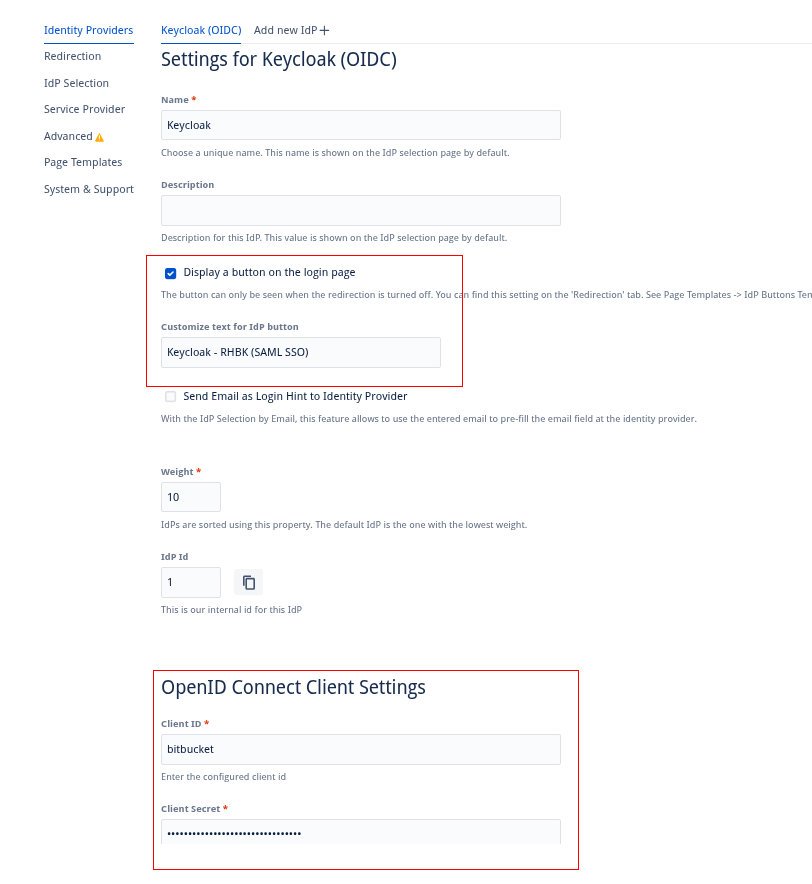

4. **User Creation and Update**:  
   * In the **User Creation and Update** section, select the option **Update from UserSync-Connector**.  
   * From the dropdown, choose the Keycloak connector you created in the previous step.  

   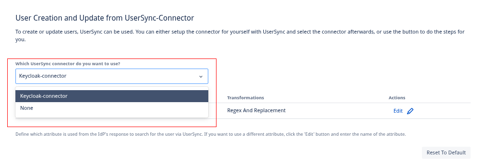

5. **Username Transformation**:  
   * To ensure usernames are consistent, configure the attribute transformation to strip the domain from the email address.  
   * Under **Attribute as received from Keycloak**, select the template **Use EMAIL for username and strip email domain**.  

   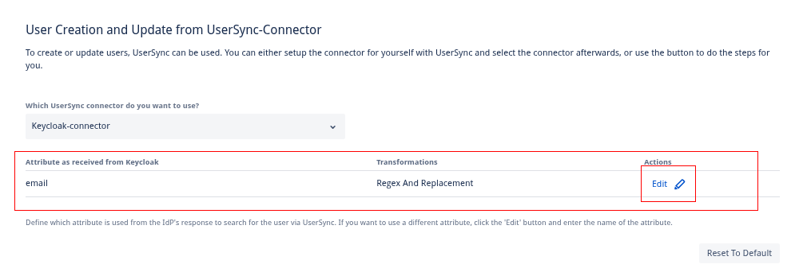  

   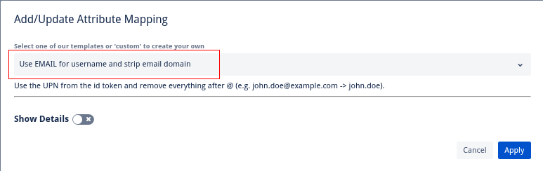  

6. **User Search**:  
   * In the **How to search for user to login** section, set **Find user by this Bitbucket attribute** to **Username**.  
   * Set the **Bitbucket Attribute** to **Username** and the **Transformation** to **Use EMAIL for username**.  

   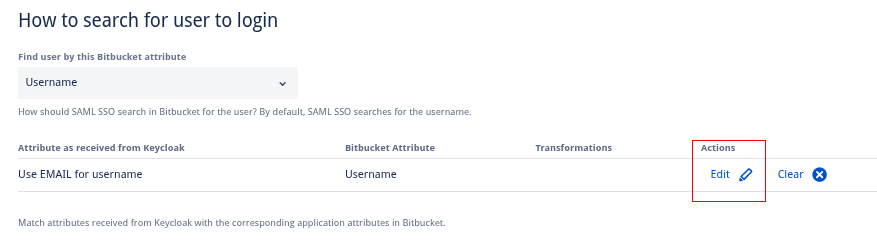  

   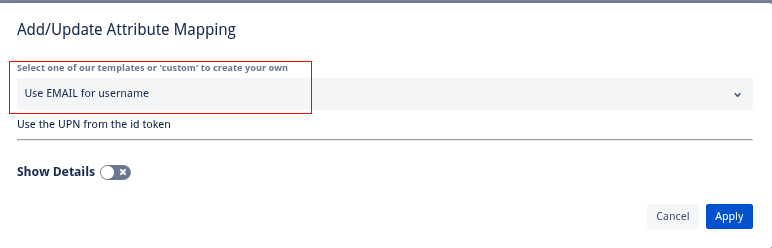  

### **3.4 Configure Login Redirection**

These settings ensure a smooth login experience and provide a fallback option.

1. **Navigate**: In the SSO app configuration, go to the **Redirection** section.  
2. **Settings**:  
   * Uncheck **Enable SSO Redirect** to prevent an automatic redirect, giving users a choice on the login page.  
   * Check **Enable nosso** to allow local Bitbucket admin login via a special URL (/login.jsp?nosso) in case of SSO misconfiguration.  
   * Set the **Default Redirect URL** to /.  

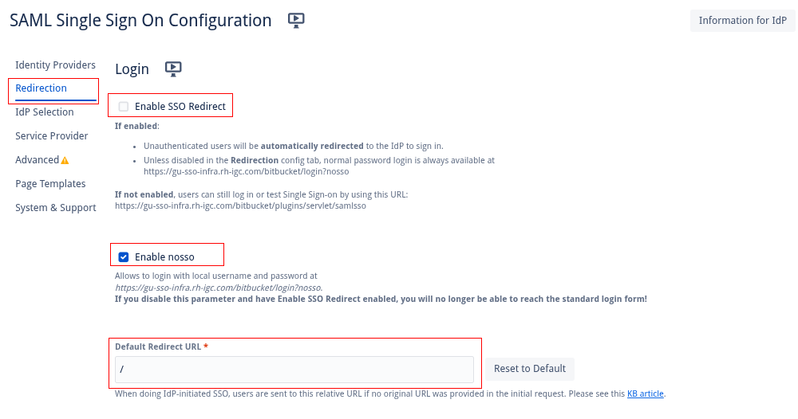

### **3.5 Advanced Configuration**

To ensure Keycloak remains the single source of truth for user identity:

1. **Navigate**: In the SSO app configuration, go to the **Advanced** section.  
2. **Setting**: Uncheck **Update Users from Remote Directories**.  

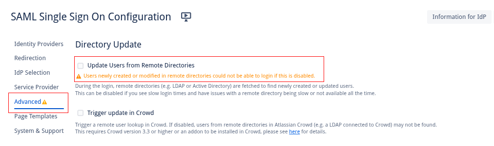

## **4.0 Assigning Permissions in Bitbucket**

With users and groups now synced, you can assign them global permissions.

1. **Navigate**: **Administration** \-\> **Global permissions**.  
2. **Add Users/Groups**: Add the groups synced from Keycloak (e.g., bitbucket-administrators, bitbucket-users).  
3. **Assign Permissions**: Grant the appropriate permission level (System admin, Admin, Project creator, Bitbucket User) to each group.

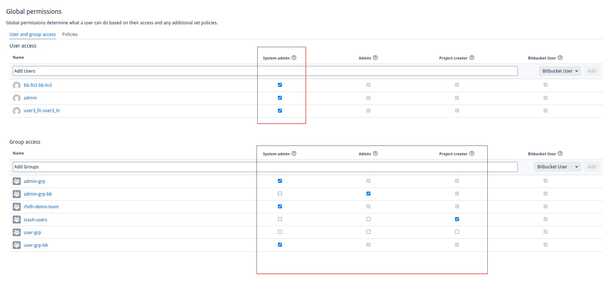

## **5.0 Alternative Approach: Using the Built-in OIDC Authenticator**

As an alternative to a paid marketplace app, Bitbucket's built-in OIDC authenticator can be used for SSO. This method provides basic authentication but lacks the advanced user provisioning and group synchronization features of the resolution GmbH app. Therefore, it requires Bitbucket to be connected directly to an external user directory, such as Active Directory, where user accounts already exist.

### **5.1 OIDC Client for User SSO**

This client handles the interactive login flow for end-users.

1. **Navigate**: Clients \-\> Create client.  
2. **Client Details**:  
   * **Client ID**: bitbucket-sso  
   * **Client type**: OpenID Connect  
3. **Capability config**:  
   * Enable **Client authentication**.  
   * Enable **Standard flow** and **Direct access grants**.  
4. **Login settings**:  
   * **Valid redirect URIs**: You will get this URL from the resolution GmbH plugin in a later step. For now, you can use a placeholder like `http://placeholder`.  
5. **Save** the client and copy the **Client secret** from the **Credentials** tab.

### **5.2 Prerequisite: Connect Bitbucket to Active Directory**

1. **Navigate**: **Administration** \-\> **User Directories**.  
2. Click **Add Directory** and select **Microsoft Active Directory**, **LDAP** or any other of your choice.  
In following example the LDAP server is used to define user directory:  

    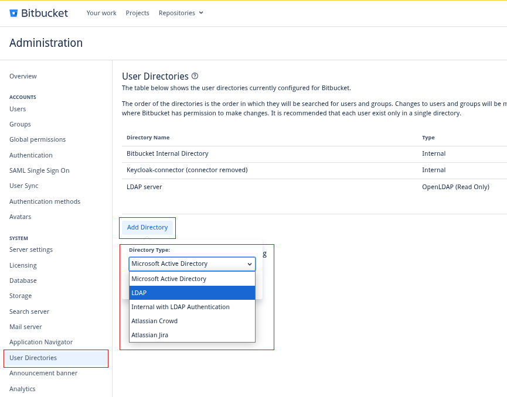  

3. **Configure Server Settings**: Enter the hostname, port, and credentials for your Active Directory server.  
  
   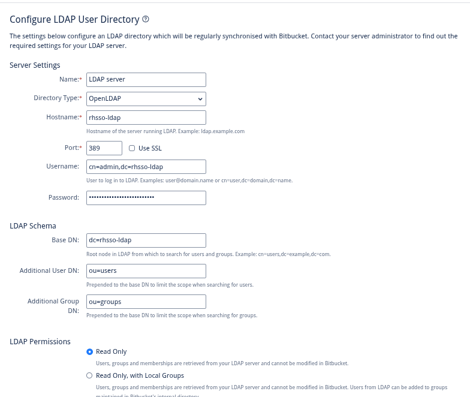  

4. **Configure Directory Schema**: Adjust the schema settings to match your Directory structure (e.g., User and Group object filters).  
    User schema settings:  

    The following is user object filter used  
    `(&(uid=*)(mail=*)(member=*))(objectClass=posixAccount)(objectClass=top)(objectClass=person)(objectClass=inetOrgPerson)(objectClass=organizationalPerson)(objectClass=extensibleObject)`  

   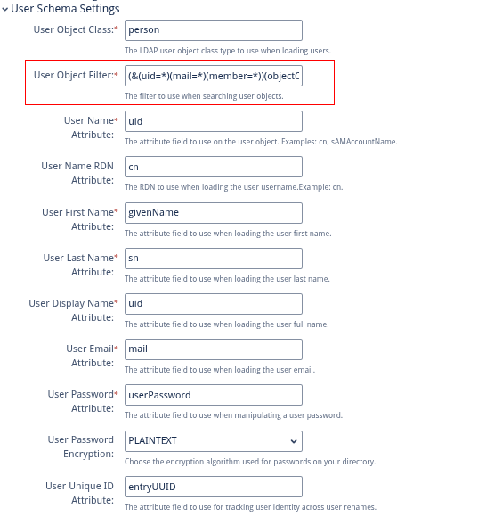  
    
    Group schema settings:  

   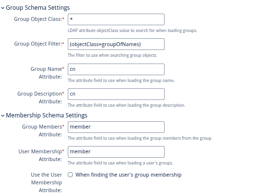  

5. **Save and Test**: Save the configuration and perform a test synchronization to ensure Bitbucket can successfully read users and groups from newly defined User Directory.  
**Imortant Notes:** 
- The first time you click on `Save and Test` button will perform only connectivity test, hence the results will look like following:  

    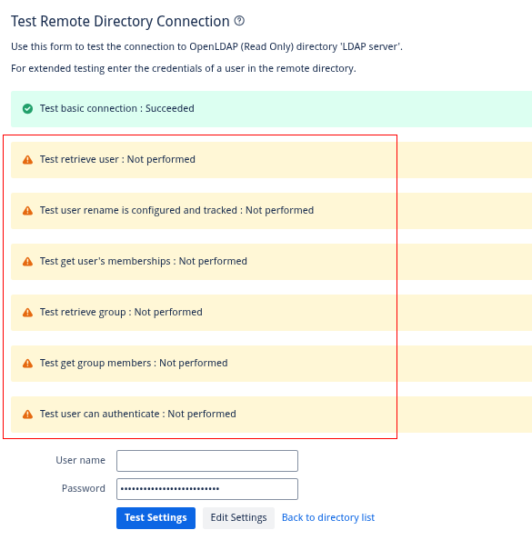  

- In order to perform full test of settings, click on `Save and Test` button will perform only connectivity test, hence the results will look like following:  

    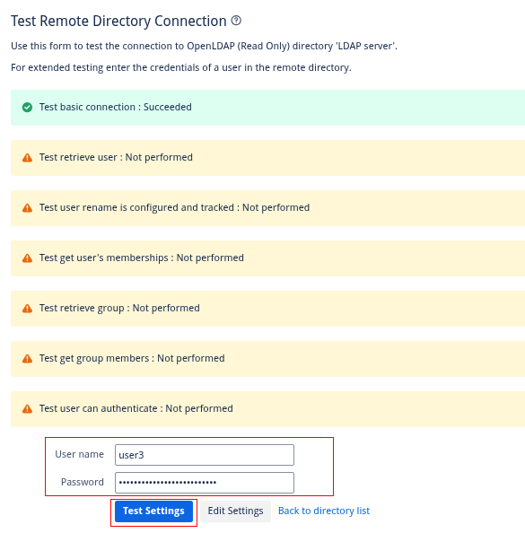  

### **5.3 Configure the Built-in Authenticator**

1. **Navigate**: **Administration** \-\> **Authentication methods** \-\> **Add configuration**.  
2. **Configure**:  
   * **Issuer URL**: https://\<sso-server\>/realms/\<realm-name\>  
   * **Client ID**: The Client ID of your SSO client in Keycloak (e.g., bitbucket-sso).  
   * **Client secret**: The secret for the client.  
   * **Username mapping**: ${preferred\_username} (This is essential for mapping the token's username claim to the user synced from AD).  
   * Fill in the endpoint URLs by copying them from your realm's .well-known/openid-configuration endpoint.

After this setup, you will see separate login buttons on the Bitbucket login page for the resolution GmbH app and the built-in authenticator, alongside the local login option.