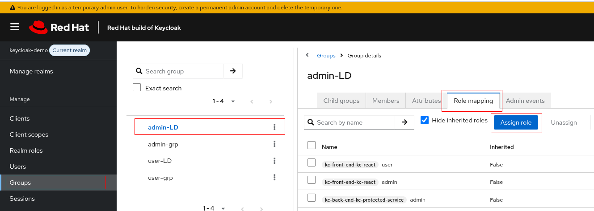

# Keycloak Integrations
#### Integration of *SSO* service with *Jenkins*    

Integrating Jenkins with Keycloak/RHBK for OIDC and RBAC
This guide provides a step-by-step process for securing a containerized Jenkins instance with Keycloak/RHBK using OpenID Connect (OIDC) for authentication and Role-Based Access Control (RBAC) for authorization.

## 1.0 Prerequisites   
- A running Jenkins instance (Containerized via Podman/Docker).   
- A running and accessible Keycloak/RHBK instance.    
- Network connectivity between the Jenkins host, Keycloak host, and the end-user's browser.

## 2.0 Keycloak/RHBK Server Configuration
### 2.1 Create OIDC Client for Jenkins
First, create a new client in your desired Keycloak realm.

1. Navigate: Clients -> Create client

    Client creation:
       

2. Client Details:  
    Client type: public, OpenID Connect     
    Client ID: e.g., `jenkins-public`   
    Authentication flow: Ensure Standard flow is enabled.   

    General settings:
      

    Capability settings:
      

3. Configure Redirect URI: Set the Valid redirect URIs to your Jenkins callback URL.

    Examples:   
    `https://jenkins.mycompany.com/*` - works, but more broader than needed.
    `https://jenkins.mycompany.com/securityRealm/finishLogin/*`

    Login settings:
      


### 2.2 Define Realm Roles
Create logical roles within Keycloak that will be mapped to Jenkins permissions.

1. Navigate: Realm Roles -> Create role
      

2. Create Realm Roles:

    `jenkins_admin` - administration.

    `jenkins_user` - regular user, able run, define, delete jobs.

    `jenkins_readonly` - restricted user, demonstrate a mimimal permissions.

      

### 2.3 Define Client Roles
1. Create Client Roles:
    Navigate: Clients -> `jenkins-public` -> Client Details->  Roles -> Create role     

      

   The client roles may have a different names, but for simlpicity, the same names will  used: `jenkins_admin`, 
   `jenkins_user`, `jenkins_readonly`  

     

2. Bind realm and client roles
 Navigate: Clients -> `jenkins-public` -> Client Details->  Roles.  
 Click on link (for example: `jenkins_admin`) on table below.   
        

On page opened, select the `Associated Roles` tab as shown below and click on `Assign role` button:    
    
  

On the pop-up opened, select the `Filter by realm roles` from combobox as shown below, select checkbox includes a realm role(for example: `jenkins_admin`) and click on `Assign` button:    

  

Repeat on the steps of above in order to bind as much roles as needed for different Jenkins roles defined. When finished, the all properly binded roles wil have an attribute `Composite = True` as shown below:    

  

### 2.3 Configure Protocol Mappers
Mappers add specific information to the OIDC tokens. These are configured on the Jenkins client page.

1. Navigate: Clients -> `jenkins-public` -> Client details -> Client scopes.    
In order to create mappers click on `jenkins-public-dedicated` link:    

      

On the next screen, click on `Add mapper` and select `By configuration` option:   

        

In case there are no mappers defined add mapper using following:
        

On the next popup window, select `Audience' from the list of mapper types as following:
    

2. Create Audience Mapper:
- Purpose: Prevents "Expected audience not available" errors.
- Mapper type: `Audience`
- Mapper name: `jenkins-audience` - logical name, may be any of your choice.
- Included Client Audience: Select the `jenkins-public` client itself.
- Add to access token: `ON`
     

3. Create User Realm Role Mapper:
- Purpose: Passes Keycloak roles to Jenkins.
- Mapper type: `User Realm Role`
- Mapper name: `groups` - logical name, may be any of your choice.
- Token Claim Name: `roles` (The Jenkins plugin expects this name).
- Multivalued: `ON`
- Add to access token: `ON`
- Add to userinfo: `ON`
     

4. Create Audience Resolve Mapper:
- Purpose: Prevents "Expected audience not available" errors.
- Mapper type: `Audience Resolve`
- Mapper name: `audience resolve` - logical name, may be any of your choice.    

     


### 2.4 Role and Group Binding and/or Role and User Binding in RHBK
In RHBK, you can efficiently manage permissions by mapping groups to specific client roles. This allows for automatic role assignment based on a user's group membership, which is often imported from an external source like LDAP or Active Directory.

The process involves these key steps:

1. **Create Client Roles:**     
Define application-specific roles within your `jenkins-public` client (e.g., `jenkins_admin`, `jenkins_user` or `jenkins_readonly`) as explained in [Define Client Roles](#23-define-client-roles) paragraph.

2. **Map Groups to Client Roles:**  
Navigate to the **Groups** section. Select a group (e.g., AD-Jenkins-Admins), go to the **Role mapping** tab, and assign the appropriate client role (e.g., jenkins_admin) to the entire group. Any user in that AD group will now automatically inherit the admin role for Jenkins.

In the following example the `admin-LD` which is imported from Active Directory, is binded to `jenkins_admin` role.

Navigate:   
  

Selected group:   
 

Assign roles:  
 


3. **Handle Special Cases with User-Specific Roles:**   For special cases where group binding isn't suitable, you can assign roles directly to a specific user.     
Navigate to the **Users** section, select a user, go to their **Role mapping** tab, and assign the necessary client role. This provides flexibility by allowing you to override or supplement group-based permissions for individual users.

In the following example the `user1` which is not belonging to the any of imported Active Directory groups, is binded to `jenkins_user` role.

Navigate:   
    

Selected user:     
 

Assign roles:  
 

## 3.0 Jenkins Server Configuration
### 3.1 Install Necessary Plugins
Ensure the following plugins are installed via Manage Jenkins -> Plugins:

- `Keycloak Authentication`
- `Role-Based Authorization Strategy`

### 3.2 Establish Trust with Keycloak/RHBK (HTTPS)
If your Keycloak instance uses a certificate from a private or self-signed CA, the Jenkins JVM must be configured to trust it.

> **Note:** This Dockerfile performs two critical, distinct security functions:
>
>- `COPY ./server.jks ...`: This command copies the server's `Identity Keystore`.     
>This file contains the private key and certificate that Jenkins uses to prove its own identity to web browsers and serve its user interface over secure HTTPS.
>
>- `COPY ./ca.crt ...`: This command copies your organization's Root CA Certificate.    
>This certificate is imported into the Java Virtual Machine's (JVM) global truststore, allowing Jenkins to trust and make secure outbound connections to other internal services, like RHBK, that are signed by the same authority.

The Dockerfile to create a trusted image:
```Dockerfile
# Use a recent official Jenkins LTS image
FROM jenkins/jenkins:2.452.3-jdk17

# Switch to root user to install plugins
USER root

# Copy the Java keystore into Jenkins home
COPY ./server.jks /var/jenkins_ssl/

# Optional: Set permissions (not always needed, but safe to do)
RUN chown jenkins:jenkins /var/jenkins_ssl/server.jks

# Copy the lab's root CA certificate into the container
COPY ./ca.crt /tmp/root-ca.crt
RUN keytool -importcert -keystore ${JAVA_HOME}/lib/security/cacerts \
    -storepass changeit -noprompt -alias lab-root-ca -file /tmp/root-ca.crt

# Install the Keycloak Authentication plugin
EXPOSE 8080
EXPOSE 8443
EXPOSE 50000
ENV JENKINS_OPTS="--httpPort=-1 --httpsPort=8443 --httpsKeyStore=/var/jenkins_ssl/server.jks --httpsKeyStorePassword=<keystore-password>"

# Switch back to jenkins user
USER jenkins

```

### 3.3 Configure Global Security
1. Navigate: Manage Jenkins -> Security    

2. Security Realm: Select Keycloak Authentication Plugin.
    - Enter your Keycloak server details (URL, Realm, Client ID, etc.).

3. Authorization: Select Role-Based Strategy.

     


### 3.4 Configure Role-Based Strategy
1. Navigate: Manage Jenkins -> Manage and Assign Roles -> Manage Roles

2. Define Global Roles: Create internal Jenkins roles and assign permissions.

    Use `Role to add` section to add roles to the roles matrix:     
    - `admin`: Grant Overall/Administer.

    - `jenkins_user`: Grant Overall/Read, Job/Cancel, Job/Delete, Job/Read, Job/Create, Job/Workspace, Job/Build, Job/Move, Job/Configure, Job/Discover.

    - `jenkins_readonly`: Grant Overall/Read.

The Manage Roles configuration:     


3. Navigate: Manage Jenkins -> Manage and Assign Roles -> Assign Roles

4. Map Keycloak Roles: Map the roles coming from Keycloak (which the plugin sees as "groups") to the Jenkins roles you just created.

- Clear Defaults: Remove all permissions for anonymous and authenticated.

- Add Mappings:
    Use `Add group` button to assign roles:     
    - Add group jenkins_admin and assign it the admin role.
    - Add group jenkins_user and assign it the user role.
    - Add group jenkins_readonly and assign it the readonly role.

The Assign Roles configuration:     


### 3.5 Setup completed
When every settings are defined properly, the navigation to `https://jenkins.mycompany.com:84443/` page should show login page from SSO server:     


## 4.0 Troubleshooting and Best Practices
This section details common issues encountered during the integration process and provides the definitive solutions. Adhering to these practices will ensure a stable and secure configuration.

### 4.1 Handling Stale State in Persistent Volumes
A common pitfall during initial setup is a failed container launch leaving behind corrupted or incomplete data in its persistent volumes.

**Symptom:** After a failed first run, subsequent attempts to start the container fail immediately. Logs may show configuration errors or complain about an inconsistent state.

**Root Cause:** The container's startup script detects the non-empty volume and attempts a normal start instead of running the crucial first-time initialization. This fails because the data in the volume is from a previously failed setup.

**Solution:** Before retrying a failed deployment, you must completely remove the old state. This involves stopping and removing the old container, clearing the volume data, and rebuilding the image to ensure a clean start.
```sh
# 1. Stop and remove the old container
podman stop jenkins
podman rm jenkins

# 2. IMPORTANT: Delete the contents of the host volume to clear stale data
sudo rm -rf /opt/podman-volumes/jenkins/*

# 3. Rebuild the image to ensure it's fresh (--no-cache is recommended)
podman build -t my-jenkins --no-cache -f ./Dockerfile .

# 4. Relaunch the container with the run command
podman run -d --replace --name jenkins \
  -p 8443:8443 \
  -p 8080:8080 \
  -p 50000:50000 \
  -v /opt/podman-volumes/jenkins:/var/jenkins_home:Z \
  --network poc-net \
  --hostname="jenkins.mycompany.com" \
  --add-host="sso.mycompany.com:<SSO_SERVER_IP>" \
  --add-host="ldap.mycompany.com:<LDAP_SERVER_IP>" \ # OPTIONAL
  my-jenkins
```

### 4.2 Recovering from an Admin Lockout
If a misconfiguration in the OIDC plugin prevents it from initializing correctly, you will be locked out of the Jenkins UI.

**Symptom:** After enabling the Keycloak security realm, you are unable to log in, and the Jenkins UI hangs or does not present a login option.

**Root Cause:** Jenkins security is enabled `<useSecurity>true</useSecurity>`, but the configured security realm (OIDC/Keycloak) is failing to start due to a critical error (e.g., TLS trust, configuration mismatch). This creates a catch-22 where you cannot access the UI to fix the broken configuration.

**Solution:** Manually disable security by editing the `config.xml` file on the persistent volume.

Stop the Jenkins container to release the file lock:
```sh
podman stop jenkins
```
Edit the configuration file. Open /opt/podman-volumes/jenkins/config.xml with a text editor.

Find the `<useSecurity>`true`</useSecurity>` line and change it to: `<useSecurity>`**false**`</useSecurity>`

For a clean recovery, it is also recommended to delete the entire `<securityRealm>...</securityRealm>` block, which contains the broken Keycloak configuration.

Save the file and restart the container:
```sh
podman start jenkins
```
Jenkins will now start with security disabled, granting you full administrative access to fix the configuration in the UI.

### 4.3 Resolving TLS Trust Errors (PKIX Path Failure)
When Jenkins communicates with Keycloak over HTTPS, its underlying Java Virtual Machine (JVM) must trust Keycloak's SSL/TLS certificate.

**Symptom:** The Jenkins log shows an SSLHandshakeException containing the error PKIX path building failed: unable to find valid certification path to requested target. The Keycloak login page will not load.

**Root Cause:** The Keycloak server is using a certificate signed by a private or self-signed Certificate Authority (CA), and the Jenkins JVM's truststore does not contain this CA.

**Solution:** You must import your organization's Root CA certificate into the Jenkins JVM's global truststore (cacerts). The most robust method is to build a custom container image that adds this certificate during the build process, as detailed in the Dockerfile in section 3.2.

### 4.4 Correcting OIDC Token Audience
A successful login followed by a "forbidden" error is almost always an audience validation issue.

**Symptom:** The user authenticates successfully at Keycloak but is then redirected to a Jenkins error page. The Jenkins log shows `org.keycloak.common.VerificationException: Expected audience not available in the token...`.

**Root Cause:** The OIDC token issued by Keycloak is not explicitly "addressed" to the Jenkins client. The aud (audience) claim in the token does not contain the Jenkins client's ID, so Jenkins rejects it as a security precaution.

**Solution:** Add a protocol mapper to the Jenkins client configuration in Keycloak.

- Navigate to **Clients** -> `Your-Jenkins-Client` -> Client details -> "`Your-Jenkins-Client`-dedicated" -> **Mappers**.
- Create a new mapper of type **Audience**.
- In the **Included Client Audience** dropdown, select the **Jenkins client itself**.
- Ensure **Add to access token** is enabled (`ON`).


### 4.5 Enforcing Mandatory Login via Authorization
By default, Jenkins can be configured to allow anyone to see the main dashboard, which prevents the OIDC login flow from triggering automatically.

**Symptom:** Users visiting the Jenkins URL see the main dashboard instead of being immediately redirected to the Keycloak login page.

**Root Cause:** The Role-Based Authorization Strategy is configured to grant the special `Anonymous` or `authenticated users` with `Overall/Read` permissions.

**Solution:** In Jenkins, navigate to **Manage Jenkins** -> **Manage and Assign Roles** -> **Assign Roles**.    
Find the rows for `Anonymous` and `authenticated users` and ensure **all permission checkboxes are unchecked**.     
Removing them from the list entirely is also effective. This makes the entire site a protected resource, forcing authentication for any access.

### 4.6 Resolving Token Deserialization Errors
The Jenkins plugin expects to receive role information in a specifically named claim within the token. A mismatch will cause the token to be rejected.

**Symptom:** The Jenkins log shows a deserialization error after a successful login, such as `Unrecognized field "groups" (class org.keycloak.representations.AccessToken$Access), not marked as ignorable`.

**Root Cause:** The "User Realm Role" mapper in Keycloak was configured to put roles into a claim named `groups`, but the Jenkins plugin's internal code is expecting a claim named `roles`.

**Solution:** In the configuration for your User **Realm Role** mapper in Keycloak, ensure the **Token Claim Name** field is set to exactly `roles`. This ensures the data in the token matches the structure the plugin is built to understand.